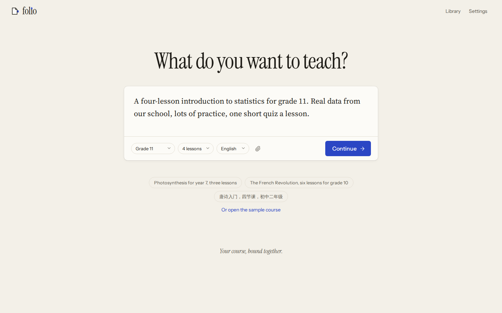
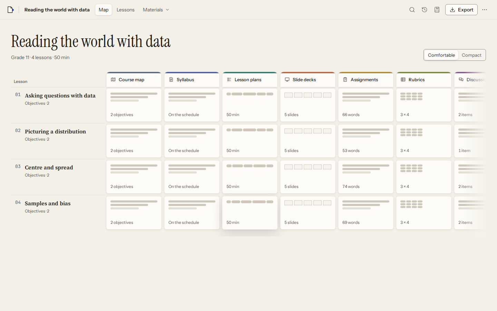
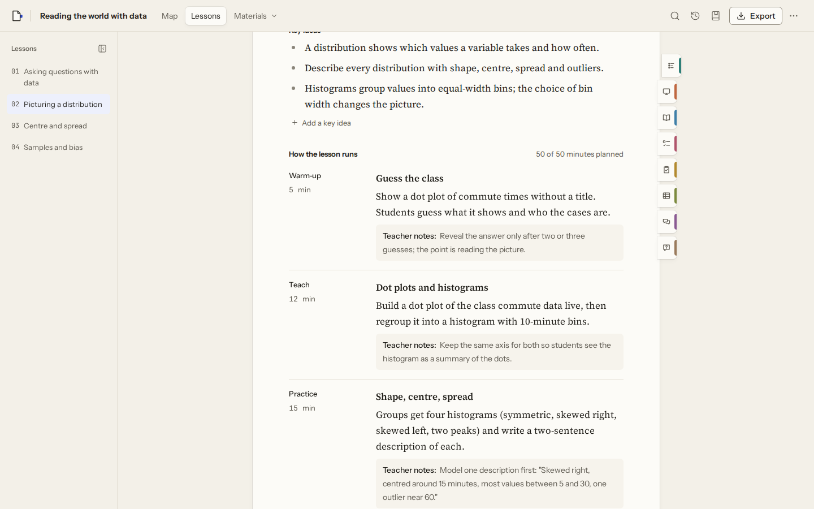
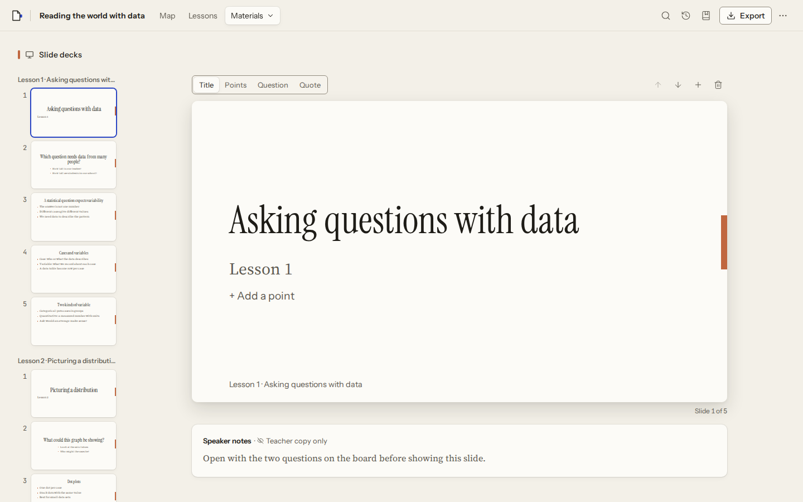
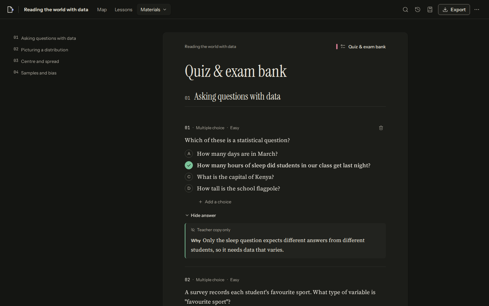

# folio · 墨页

*Your course, bound together.* / *一门课，装订成册。*

Folio turns a paragraph about what you want to teach into a course: an outline you agree first, then ten linked, editable materials built from one course document. Change an objective once and everything that depends on it knows.



| The map: lessons × materials | One lesson, in teaching order |
| --- | --- |
|  |  |
| **Slides: filmstrip, stage, speaker notes** | **Quiz bank, dark ("chalkboard")** |
|  |  |

## Try it

```sh
pnpm install
pnpm dev            # http://localhost:5173
```

- **Without a model:** choose *Or open the sample course* on the home page. It is a hand-written four-lesson statistics unit with every material filled in, so you can edit, undo, export and print straight away.
- **With a model:** type a brief and press *Continue*. Folio asks you to connect a model: your own Claude, OpenAI, Gemini or DeepSeek key, or a local OpenAI-compatible server (Ollama, LM Studio) for "on this device". Keys stay in the browser, and requests go straight from the browser to the provider.

## What it does

1. **Describe.** One box: "What do you want to teach?" Drop in `.txt`, `.md` or `.docx` notes. The level, lesson count and language chips fill themselves in from what you type.
2. **Plan.** The first model call returns only an outline. You rename, reorder (drag or arrow buttons), add or remove lessons, edit objectives, set minutes and quiz size, and choose which materials to build.
3. **Build.** The map fills in lesson by lesson, with at most four jobs at a time. One line in the header tracks progress ("Building lesson 3 of 6 · Stop"). When it finishes, one toast says what needs a look.
4. **Adjust.** Everything is edited in place on the page. When an objective, lesson, plan, level or source changes, the sections built from it are marked out of date, with a reason. You can *Update*, *Keep mine*, or *Compare* the update with your own version. An update never overwrites text you wrote.
5. **Ask.** Select text to *Rewrite, Simplify, Harder, Easier, Translate* or *Explain*. The suggestion appears inline under a highlighter sweep for you to accept or reject. `⌘K` searches and navigates, and turns requests such as "add a lesson on sampling bias after lesson 2" into a plan you preview before it runs.
6. **Deliver.** The Export drawer asks three things: what (whole course, one lesson, chosen materials), who (student or teacher copy) and format. Formats are Word, PDF (print view), PowerPoint, a spreadsheet of the quiz bank, a ZIP of everything, or a `.folio` backup. A live preview shows the first page. A student copy can never contain answers, because projections filter by audience before any exporter runs.

University courses are taught as universities teach: lectures and seminars instead of school routines, weekly readings and a grading scheme taken from the brief, rubric levels named after the local grade bands (First to Third, or A to D), and suggested further reading kept apart until the teacher adds it. When a brief asks for source work and nothing is attached, the home page suggests attaching the sources.

The ten materials are the course map, syllabus, lesson plans, slide decks, assignments, rubrics, discussions, quiz & exam bank, study guides and course FAQ. Every screen has a URL: `/c/:id/map`, `/c/:id/lesson/:lessonId`, `/c/:id/m/:kind`. The interface is available in English and 简体中文, and it has light and dark themes.

## How it is built

```text
apps/web/          routes, screens, drawers, command bar, state, i18n (React 19, TanStack Router)
packages/core/     the Course schema (Zod), commands + undo, ripple, projections, checks, sample course
packages/ai/       one Inference port, Anthropic/OpenAI/Gemini/DeepSeek/local adapters, prompts, jobs, build queue
packages/export/   SemanticDoc → .docx, .pptx, .xlsx, .csv, .zip and .folio
packages/ui/       tokens.ts (→ tokens.css), React Aria primitives, domain components
```

The dependencies point one way: `core` ← `ai`/`export` ← `ui` ← `web`. ESLint enforces this: `core` imports nothing from the other packages, and none of `core`, `ai` or `export` imports React, storage or the app.

- **One source of truth.** A course is one Zod-validated document. Entities are records keyed by stable IDs, and every relationship is an ID, never an array position. Lesson count, minutes and quiz size are fields in the document, never words inside a prompt.
- **Commands, undo, history.** Every change, whether you typed it or the model proposed it, is a typed command applied with Immer patches. Undo checks that nothing changed the same content since, so you can undo any single entry in the history, not only the last one, and it refuses when undoing would clobber later work. Build steps appear in history but are skipped by `⌘Z`.
- **Ripple.** A generated section records hashes of the inputs it was built from: lesson, objectives, minutes, quiz size, level and language, plan, sources. If a hash no longer matches, the section is out of date, and the reason can be named.
- **Projections.** Each material is a pure function, `project(course, kind, { audience, lessonIds }) → SemanticDoc`. The screen's print view, the export preview and every exporter read the same projection. Overrides let one material word a shared entity differently.
- **Schema-first AI.** Jobs are small and typed: an outline, then per lesson a plan, slides, study guide, questions, an assignment with its rubric, discussions and FAQ. Each job asks for JSON against a Zod-derived schema, validates it, then runs deterministic checks: the answer must be one of the choices, choices must be distinct, arithmetic answers are recomputed from the model's working, and segment minutes must add up. It is allowed one repair call that quotes the problems, and an answer that is not valid JSON, or was cut off, gets the same one call. Anything still wrong is kept and marked "needs a look", never patched with a regex. Claude runs through the official Anthropic SDK with structured outputs; `claude-sonnet-5` is the default, and on Opus 5 and Fable 5.1 refusals fall back server-side. DeepSeek runs through its OpenAI-compatible API with JSON mode and the schema in the prompt.
- **Local-first.** Each change is written to IndexedDB (Dexie) within 300 ms, and nothing is ever pruned. Undo history (the last 200 entries) is saved beside the course in the same transaction, so undo still works after a reload or a switch to another course. If the page closes before a save lands, a synchronous copy kept in localStorage is replayed on the next load. Two tabs on one course never overwrite each other silently: each save checks the stored version, an idle tab follows the other's saves, and a tab with unsaved edits pauses and asks which copy to keep. Word and PowerPoint files are made in a Web Worker (Comlink). A `.folio` file is a zip of `course.json`, `manifest.json` and `sources/`.

## Design system

The look is "paper and ink": warm desk, paper sheets, one fountain-pen blue, and ten muted binder-tab colours that mark materials, and only mark them. Instrument Serif is the display face, Source Serif 4 the reading face on sheets (17/28), Instrument Sans the interface face, and JetBrains Mono is used sparingly. Noto Serif SC loads subset by subset for Chinese. Every colour, size, radius, shadow and duration lives in [`packages/ui/src/tokens.ts`](packages/ui/src/tokens.ts). `pnpm tokens` generates the CSS variables and a Tailwind `@theme` from it, and the exporters read its light palette. Components may not use raw hex values or arbitrary Tailwind values; a lint rule checks this. Contrast is tested, not eyeballed: text is at least 4.5:1, and UI marks and control borders at least 3:1, in both themes.

## Quality

| Check | Command | Result |
| --- | --- | --- |
| Types (strict) | `pnpm typecheck` | clean |
| Lint (warnings fail; files ≤ 400 lines, functions ≤ 60) | `pnpm lint` | clean |
| Unit tests (one glob, every file runs) | `pnpm test` | 401 tests |
| End to end + axe (WCAG 2.2 AA) + CSP guard | `pnpm test:e2e` | 68 tests, light, dark and phone |
| Budgets | `pnpm build && pnpm budget` | initial JS 140 KB gzip (≤ 150), all JS 2.8 MB (≤ 3), dist 6.7 MB (≤ 8) |

`pnpm check` runs everything except the end-to-end tests. The end-to-end tests run the production build under the production Content-Security-Policy, with a stand-in for the Anthropic API that answers each job from its prompt. Any CSP violation or uncaught error fails a test. `cd apps/web && FOLIO_TOUR=/tmp/tour npx playwright test tour` takes a screenshot of every screen for design review.

## Testing against a real model

The end-to-end suite uses a stand-in model. To see what a real model does with Folio's prompts, schemas and checks, route the app's Claude calls through the local Claude CLI:

```sh
node scripts/claude-bridge.mjs                # an Anthropic-style endpoint on :8787 that answers via `claude -p` (Opus 5.5 by default)
LIVE=en pnpm test:live build                  # build a whole course: en, zh, stats, sources, vague or history
PROF=econ pnpm test:live professor            # a university course, every material screenshotted: econ, phil or psych
pnpm test:live assist zh-interface            # selection actions, ⌘K requests, a ripple update; the Chinese interface
DEEPSEEK_API_KEY=… node scripts/deepseek-bridge.mjs   # the same endpoint, answered by DeepSeek instead (cheap; capped at $3 a run, $15 in all)
BRIDGE=direct ANTHROPIC_API_KEY=… PROF=econ pnpm test:live professor   # no bridge: the app's own requests go to the Anthropic API (log in live-results/direct.jsonl, $3 cap a run)
python3 scripts/token-report.py               # tokens and dollars per job
python3 scripts/score-live.py                 # answer positions, true/false balance, lengths, flags, timing, cost
```

Each run saves the course, every call and screenshots under `apps/web/live-results/`. Runs against Opus 5.5 shaped several fixes: correct answers used to sit at choice A in 22 of 26 questions (quizzes now balance positions after generation), every true/false answer was "False", text actions grew one-line summaries into paragraphs, slides wrote "lesson 1 of 4" into the text, a British teacher's course came back in dollars, and the brief's lesson length was ignored. On its own a four-lesson course builds in about two and a half minutes for about $1.30. On DeepSeek (`deepseek-flash`) the same course takes 29 calls, usually with no repair, in under two minutes for about $0.10; the running record, including a side-by-side with Sonnet 5 that separates model habits from pipeline faults, is in [`docs/handoff.md`](docs/handoff.md).

## Deploying

The web app is static. On Cloudflare Pages, use build command `pnpm build` and output directory `apps/web/dist`. `public/_headers` carries a strict CSP (no `unsafe-inline`: the build hashes the one inline script and React Aria's two injected styles into it) along with `frame-ancestors 'none'` and immutable caching for assets. `public/_redirects` handles deep links. Google Docs export appears only when `VITE_GOOGLE_CLIENT_ID` is set at build time.

## Where this differs from the design doc

These are deliberate, and each keeps the doc's intent:

- **Plain-text fields instead of Tiptap.** The course is structured data, so each field is edited in place as text. This keeps the first load under budget. A field may carry light marks, typed as teachers already type them: `` `lm(y ~ x)` `` for code, `β̂_educ`, `t_{n−k−1}` and `R^2` for sub- and superscripts. At rest they are set as code, subscripts and superscripts, with Greek accents drawn over their letters; while a field is edited the marks show. Word and PowerPoint get real code runs and sub- and superscripts. Callouts and display maths are not supported.
- **A typed message catalogue instead of Lingui.** English and Chinese live in two TypeScript objects, and a test keeps their shapes identical.
- **Generation runs on the main thread.** Model calls are network-bound, so only exports use a worker. A stopped or interrupted build resumes from the header ("Paused · 12 sections left · Resume").
- **PDF comes from the print view.** You get it with "Save as PDF". The sheet *is* the printout, and Chinese typesets correctly. The Typst spike has not been done.
- **"On this device" means a local OpenAI-compatible server,** such as Ollama or LM Studio, rather than a 3 GB in-browser download.
- **Two contrast tokens changed.** The doc's `good` and `attention` colours were a little below AA on paper, so they are slightly darker (`#37704E`, `#94600E`). `field` was added for control borders that need 3:1.

Not built yet (Phase 5 of the doc, or needing inputs this repository doesn't have): the Folio relay and a free tier, accounts and sync, the MCP authoring adapter, an importer for legacy `.coursemapper` files (no sample files were available to test against), the Ladle component catalogue (the screenshot tour stands in for design review), and the `folio-evals` repository. Google export is implemented but untested without a client ID.
